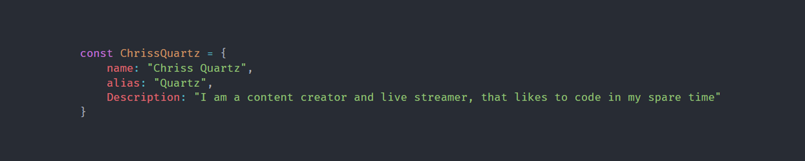

<h1 align="center">Hello, 👋 I'm Chriss Quartz🖥</h1>

  <h3 align="center">I am a content creator and streamer, but I love to code and create stuff in my free time. You can find my links below</h1>

  &nbsp;&nbsp;
  &nbsp;&nbsp;
  &nbsp;&nbsp;
  
  
  

  <h2 align="center">Some of the languages I use are:</h2>
  
  
  
  
  
  
  <h2 align="center">My Github Stats<h2>
  
    

  <h2 align="center">Recent Youtube Videos<h2>
    <!-- BLOG-POST-LIST:START -->
- [OptikServers | Free Minecraft Hosting Solutions | 99% Uptime](https://www.youtube.com/watch?v=oEK7eSYUja4)
- [How to make a minecraft server without port forwarding | 1.18+ [Links in description]](https://www.youtube.com/watch?v=F2n4SbLQu8E)
- [[FREE] How to install and use Cloaks+](https://www.youtube.com/watch?v=Gdxi7TPyHMQ)
- [Thank you!!, There is also an announcement](https://www.youtube.com/watch?v=x8YJ12VVO2Q)
- [Gamin with dondyblondie2 and viewers!!](https://www.youtube.com/watch?v=D1egzZiQLWk)
<!-- BLOG-POST-LIST:END -->

